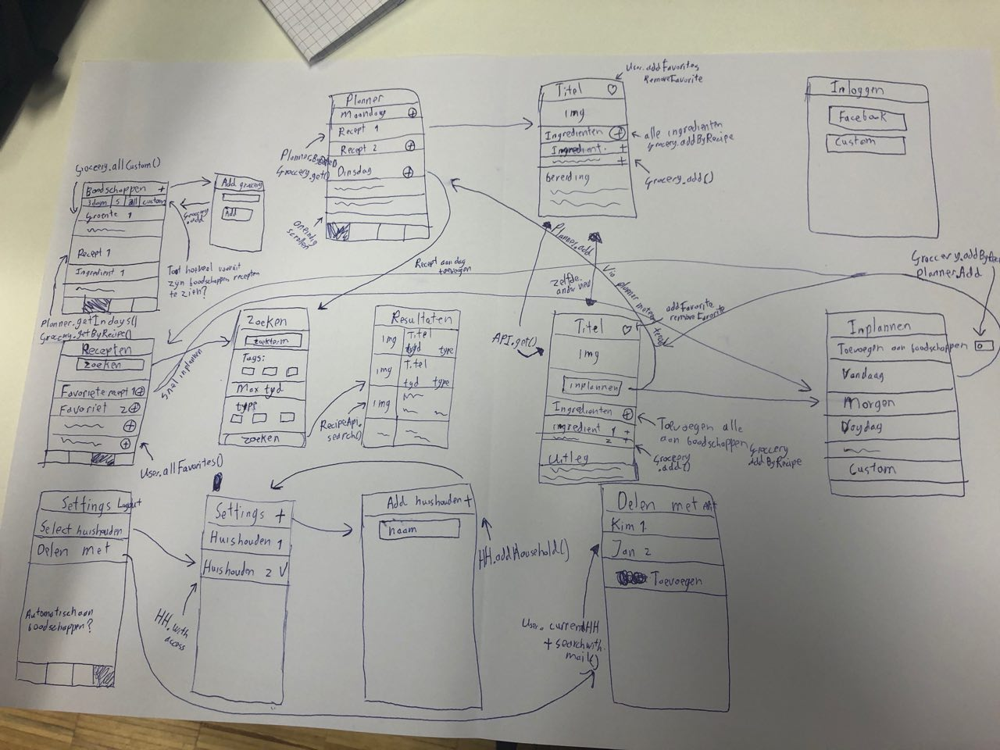

# Design van Reciper

## Belangrijke calls per scherm:

#### Inloggen
- FirebaseAuth

#### Home boodschappen
- GroceryModel.allCustom()
- PlannerModel.getInDays(n) -> GrocceryModel.getByRecipe()
- GroceryModel.done() / GroceryModel.undone()

#### Boodschap toevoegen
- GroceryModel.add()

#### Favorieten recepten
- UserModel.allFavorites()
- In edit: UserModel.removeFavorite()

#### Zoeken
Nog niks (Misschien API inbouwen die alle tags terug geeft)

#### Zoek recepten resultaten
- RecipeAPI.search()

#### Los recept
- RecipeAPI.get()
- GroceryModel.add() (Losse boodschap uit rijtje toevoegen)
- GroceryModel.addByRecipe() (Button toevoegen alle boodschappen)

#### Inplannen
- GroceryModel.addByRecipe() (Als automatisch toevoegen aan staat)
- PlannerModel.add()

#### Home planner
- PlannerModel.getByDate()
- RecipeModel.get()

#### Home Instellingen
- UserModel.getCurrentHousehold()

#### Selecteer huishouden:
- HouseHoldModel.allWithAccess()
- UserModel.setCurrentHousehold()

#### Huishouden toevoegen
- HouseholdModel.add()

#### Gedeeld met
- HouseholdModel.allUsers()

#### Met extra gebruiker delen
- UserModel.searchWithEmail()
- HouseholdModel.addUser()

## Belangrijke data classes:
*All deze data classes hebben een callback en degene waarbij Firebase gemoeid is. (Alle behalve RecipeAPI) Zullen ook een parameter once? hebben om te vragen of je ze eenmalig wilt ophalen of constant wil monitoren op wijzigingen.*
#### RecipeAPI
- search(term, dishType?, tags?, maxTime?) : SearchRecipeResults
- get(api_id/SmallRecipe) : FullRecipe
- fetchImage(img_url/FullRecipe/SmallRecipe)

#### RecipeModel
*Moet dit model ook locaal recepten bijhouden voor sneller laden?*
- get(id/PlannerEntity) : SmallRecipe
- create(SmallRecipe)
- createOnce(SmallRecipe) (Create only if the recipe doesnt exist, nodig?)
- remove(id/SmallRecipe)
- getMultiple(idarray) : [SmallRecipe]

#### GrocceryModel
- get(id) : GrocceryEntity
- getByRecipe(id/SmallRecipe) : [GrocceryEntity]
- allCustom() : [GrocceryEntity]
- add(GrocceryEntity)
- addByRecipe(FullRecipe)
- done(GrocceryEntity)
- undone(GrocceryEntity)
- update(GrocceryEntity, options)
- remove(GrocceryEntity)

#### PlannerModel
- create(PlannerEntity)
- move(newDate, PlannerEntity)
- getByDate(date) : [PlannerEntity]
- getDateBetween(date1, date2) : [PlannerEntity]
- getInDays(inNdays) : [PlannerEntity]

#### HouseholdModel
- allWithAccess() : [HouseholdEntity]
- removeUser(HouseholdEntity, User)
- addUser(HouseholdEntity, User)
- allUsers(HouseholdEntity)
- add(HouseholdEntity)

#### UserModel
- current() : UserEntity
- searchWithEmail(email) : UserEntity

*De volgende functies zijn allemaal gebaseerd op current()*
- addFavorite(SmallRecipe)
- removeFavoite(SmallRecipe)
- allFavorites() : [SmallRecipe]
- getCurrentHousehold()
- setCurrentHousehold(Household)

## Database:
*Hieronder zijn alle tabellen voor de app uitgeschreven. In de app zal ook elke tabel als entity class geschreven worden.*
#### Groceries /groceries/:household (Elk recept en zijn groceries of zelf toegevoegd)
- Title
- PlannerID?
- PlannerDate? (Check of de boodschappen zichtbaar moeten zijn, altijd voor eigen boodschappen)
- RecipeID?
- Done
- getPlanner()
- getRecipe()

#### Recipes /recipes/:household (SmallRecipe)
*Basisinformatie van het recept, zodat niet steeds de API aangeroepen hoeft te worden*
- API_ID
- Title
- Subtitle
- DishType
- Tags
- TotalTime
- ServingsAmount
- SmallImage (URL)

#### Planners /planner/:household
- Date
- RecipeID
- GroceryIDs
- getRecipe()
- allGrocceries()

#### Households /households
- Users
- PlanningDays (Hoeveel dagen vooruit plannen)

#### Users /users
- HouseholdIDs
- FavoriteRecipes
- currentHousehold

## API's en frameworks:
Voor de synchronisatie van de planner en de boodschappenlijst gebruik ik Firebase.

Voor het ophalen van recepten gebruik ik een zelfgeschreven API. Deze API heeft alle recepten van de Alber Heijn site gehaald en bevat zo'n 16000 recepten om doorheen te zoeken. Zie [API.md](docs/API.md) voor alle details

#### SearchRecipeResults
- results (FullRecipe array)
- searched (zoekterm)
- started (Hoeveel resultaten zijn overgeslagen)

#### SmallRecipe
- API_ID
- Title
- Subtitle
- DishType
- Tags
- TotalTime
- ServingsAmount
- SmallImage (URL)

#### FullRecipe (extends SmallRecipe)
*Deze class moet alle informatie over het recept bevatten zodat de individuele pagina van het recept gevuld kan worden. Al deze informatie hoeft niet opgeslagen te worden in Firebase en kan worden opgehaald vanuit de API.*
- API_ID
- Title
- Subtitle
- DishType
- Tags
- TotalTime
- ServingsAmount
- SmallImage (URL)
- Ingredienten (FullIngredient)
- Preperations (Array)

#### FullIngredient
*Voor nu alleen simpel ingredient, maar API biedt uitgebreidere informatie over het ingredient voor bijvoorbeeld aantal porties aanpassen.*
- Titel
