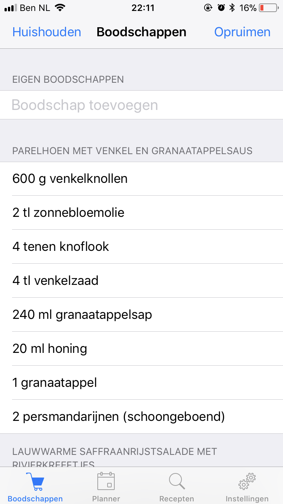
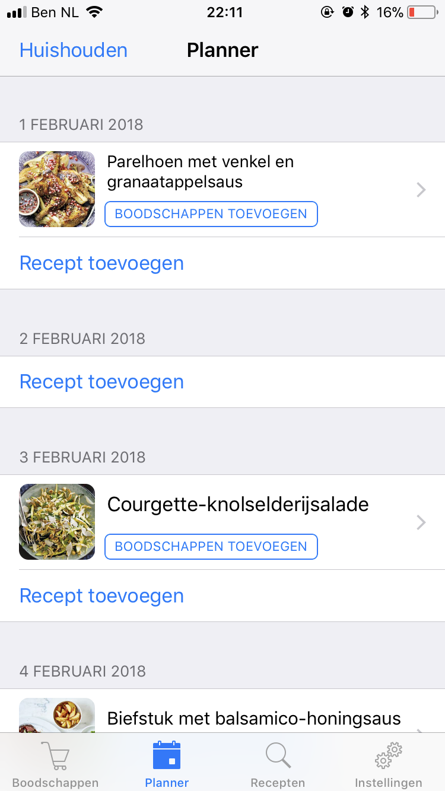
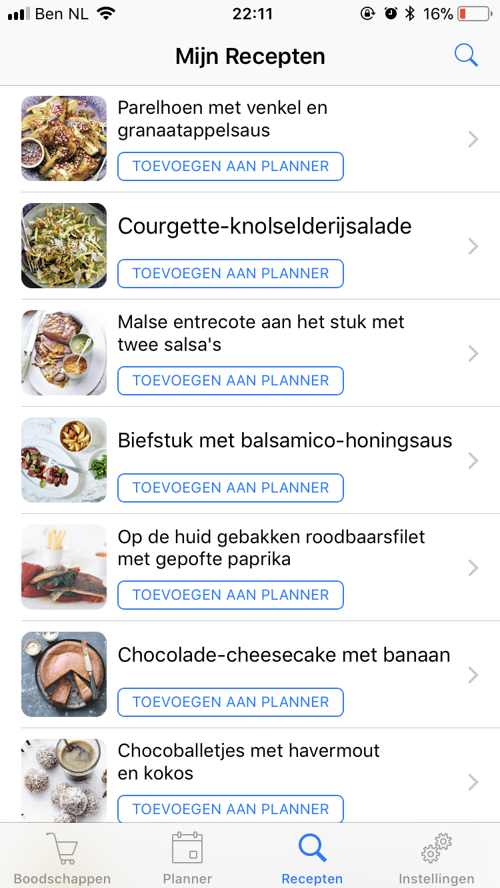
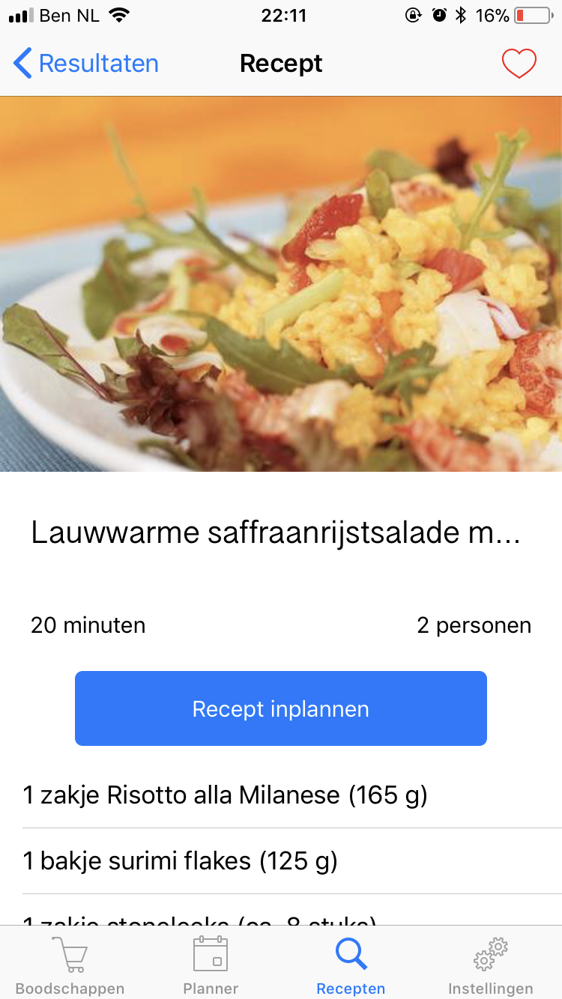
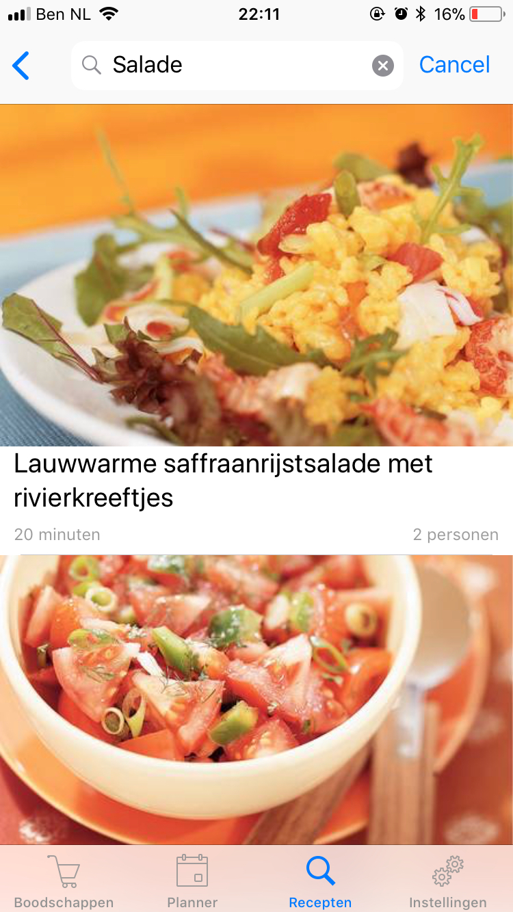

# Reciper
[Het eind report van dit project](./REPORT.md)

[Code design van de app](./DESIGN.md)

[API werking](./docs/API.md)

## Probleem en oplossing
In een druk leven van een student is het vaak lastig om elke avond naar de winkel te gaan om boodschappen te doen. En daarbij kost elke dag boodschappen doen extra tijd en extra geld, want je koopt vaak makkelijke (duurdere) en extra producten. Daarnaast is het fijn om na een lange dag te weten wat je gaat eten en meteen naar huis kunt om dat te gaan koken. 

Om dit probleem te verhelpen is het handig om een planning te maken en aan het begin van de week alle boodschappen in huis te halen. Hierbij kan een eenvoudige app helpen waar je een planning in kunt maken en op basis daarvan een boodschappenlijstje kunt samenstellen. Je kunt eenvoudig recepten toevoegen en deze aan je planning toevoegen en een boodschappenlijstje genereren op basis van de aankomende dagen.

## Visual

## Main features

### MVP
- Zoeken door recepten en weergeven (Filteren op tag, maximum tijd en type gerecht)
- Planning voor alle dagen en daar recepten aan toevoegen (infinity scroll)
- Boodschappenlijstje genereren op basis van aankomende dagen (3/5/7 etc en continue aanpassen)
- Losse boodschappen toevoegen aan boodschappenlijstje
- Favorieten recepten die je snel aan de planning kunt toevoegen
- Planning en boodschappenlijstje samen/delen met anderen uit je huis

### Optional
- Eigen recepten toevoegen (Prio 1)
- Featured recepten
- Wekelijks terugkomende recepten
- Tijdens losse boodschappen toevoegen extra suggesties doen voor recepten en ingredienten
- Aanpassen van aantal porties als je het recept wilt inplannen

## Prerequisites

### API en componenten
- Aangepaste recepten API op eigen server Zie [API.md](docs/API.md) voor de details.
- Firebase voor delen van planning

### Similar apps:
- BigOven (Recepten zoeken en boodschappenlijstje)
- Appie app (Recepten zoeken)

### Moeilijkste onderdelen
- Mogelijk maken om je complete planning te delen met andere. Hier moet je vanaf het begin al rekening mee houden, zodat niet aan het einde het alleen mogelijk is om met jezelf te delen.
- Het laten snappen van de app dat wanneer je op de 'recept toevoegen' button druk in de planning je 'Inplannen' aan het einde niet hoeft weer te geven, maar als je recepten zoekt dat het dan wel moet.
