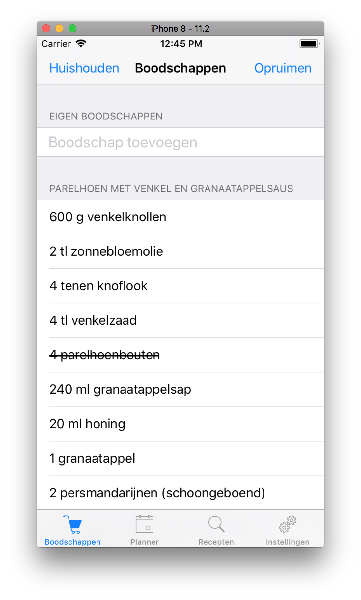

# Short description
Reciper probeert gebruikers te motiveren om weekboodschappen te doen. Dit doet reciper door een receptenplanner aan te bieden, zodat je een duidelijk overzicht hebt van wat je wanneer wilt eten. Op basis daarvan kun je zeer eenvoudig een boodschappenlijstje maken.

# Technical design
## Componenten
In de app wordt gebruik gemaakt van verschillende soorten classes die zijn ondergebracht in verschillende mappen.
* __Application directory:__ Onder deze map staan alle storyboards van de app
* __ViewControllers:__ Elk screen in de main.storyboard bevat een custom ViewController. Hiervanuit wordt de logica tussen de database en de interface gemaakt. Ook is de map van de ViewControllers weer opgedeeld in mappen voor elke onderdeel van de app.
* __Entities:__ In deze classes wordt alle data opgeslagen die zijn ingeladen vanuit de database of opgehaald wordt vanuit de API.
* __Models:__ In deze classes staat de logica om te communiceren met de database en de API. In deze classes wordt rauwe data uit de database omzet in entities. Deze extra laag maakt de ViewControllers een stuk kleiner en helpt met DRY.
* __Views:__ Hier staat custom UI elementen in, zoals een custom TableCell of een custom UIButton.
* __Library:__ Hierin staan een aantal helper functies die herhaalde logica verwijdert uit de ViewControllers.

